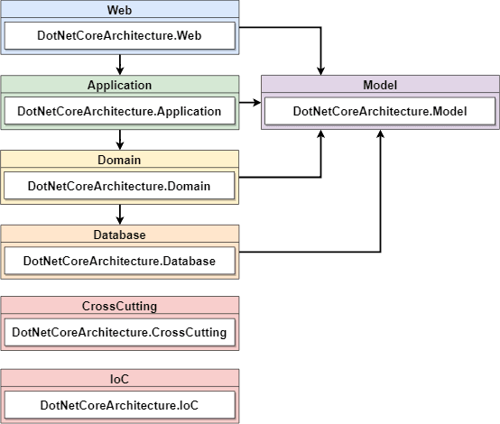
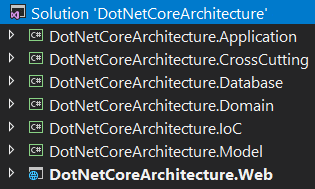
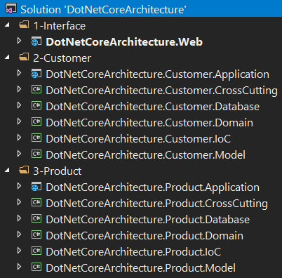
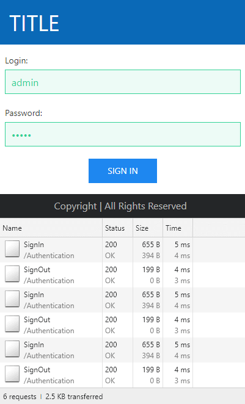
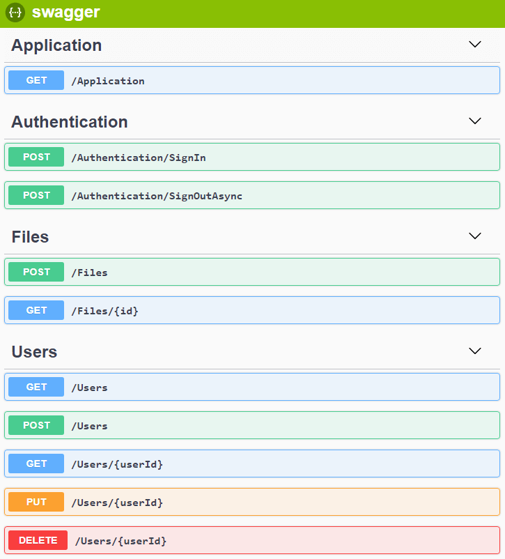

# DotNetCoreArchitecture

Architecture with new technologies and best practices to share knowledge and be used in new projects.

This architecture will be always updated with the latest version of the technologies.

## Technologies

* [.NET Core 2.2.1](https://dotnet.microsoft.com/download)
* [C# 7.3](https://docs.microsoft.com/en-us/dotnet/csharp)
* [ASP.NET Core 2.2.1](https://docs.microsoft.com/en-us/aspnet/core)
* [Entity Framework Core 2.2.2](https://docs.microsoft.com/en-us/ef/core)
* [Angular 7.2.4](https://angular.io/docs)
* [Typescript 3.2.4](https://www.typescriptlang.org/docs/home.html)
* [HTML](https://www.w3schools.com/html)
* [CSS](https://www.w3schools.com/css)
* [SASS](https://sass-lang.com)
* [UIkit](https://getuikit.com/docs/introduction)
* [JWT](https://jwt.io)
* [Swagger](https://swagger.io)
* [Docker](https://docs.docker.com)

## Practices

* Clean Code
* Code Analysis
* No Over-Engineering
* SOLID Principles
* DRY Principle (Don't repeat yourself)
* KISS Principle (Keep it simple, stupid)
* YAGNI Principle (You aren't gonna need it)
* Ubiquitous Language
* DDD (Domain-Driven Design)
* Dependency Injection
* Logging
* Object Mapping
* Response Compression
* Response Caching

## Tools

* [Visual Studio 2017](https://visualstudio.microsoft.com/vs)
* [Visual Studio Code](https://code.visualstudio.com)
* [SQL Server 2017](https://www.microsoft.com/en-us/sql-server/sql-server-downloads)
* [Postman](https://www.getpostman.com)

## Visual Studio Extensions

* [CodeMaid](https://marketplace.visualstudio.com/items?itemName=SteveCadwallader.CodeMaid)
* [Roslynator](https://marketplace.visualstudio.com/items?itemName=josefpihrt.Roslynator2017)
* [SonarLint](https://marketplace.visualstudio.com/items?itemName=SonarSource.SonarLintforVisualStudio2017)
* [TSLint](https://marketplace.visualstudio.com/items?itemName=vladeck.TSLint)

## Nuget Packages

* **Source:** [https://github.com/rafaelfgx/DotNetCore](https://github.com/rafaelfgx/DotNetCore)
* **Published:** [https://www.nuget.org/profiles/rafaelfgx](https://www.nuget.org/profiles/rafaelfgx)

## Layers



**Web:** This layer contains the api (ASP.NET Core) and the frontend (Angular).

**Application:** This layer is the main entry point of the application.

**Domain:** This layer contains the business rules and the domain logic.

**Model:** This layer is responsible for modeling the domain objects.

**Database:** This layer isolates and abstracts the data persistence.

**CrossCutting:** This layer provides generic features for other layers.

**IoC:** This layer provides inversion of control registering services.

## Projects



## Microservices Example



## ASP.NET Core Startup

```csharp
public class Startup
{
    public Startup(IHostingEnvironment environment)
    {
        Configuration = environment.Configuration();
        Environment = environment;
    }

    private IConfiguration Configuration { get; }

    private IHostingEnvironment Environment { get; }

    public void Configure(IApplicationBuilder application)
    {
        application.UseExceptionDefault(Environment);
        application.UseCorsDefault();
        application.UseHstsDefault(Environment);
        application.UseHttpsRedirection();
        application.UseAuthentication();
        application.UseResponseCompression();
        application.UseResponseCaching();
        application.UseStaticFiles();
        application.UseMvcWithDefaultRoute();
        application.UseHealthChecks("/healthz");
        application.UseSwaggerDefault("api");
        application.UseSpaStaticFiles();
        application.UseSpaAngularServer(Environment, "Frontend", "serve");
    }

    public void ConfigureServices(IServiceCollection services)
    {
        services.AddDependencyInjection(Configuration);
        services.AddCors();
        services.AddAuthenticationDefault();
        services.AddResponseCompression();
        services.AddResponseCaching();
        services.AddMvcDefault();
        services.AddHealthChecks();
        services.AddSwaggerDefault("api");
        services.AddSpaStaticFiles("Frontend/dist");
    }
}
```

## ASP.NET Core Controller

```csharp
[ApiController]
[RouteController]
public class UsersController : ControllerBase
{
    public UsersController(IUserApplication userApplication)
    {
        UserApplication = userApplication;
    }

    private IUserApplication UserApplication { get; }

    [HttpPost]
    public Task<IDataResult<long>> AddAsync(AddUserModel addUserModel)
    {
        return UserApplication.AddAsync(addUserModel);
    }

    [HttpDelete("{userId}")]
    public Task<IResult> DeleteAsync(long userId)
    {
        return UserApplication.DeleteAsync(userId);
    }

    [HttpGet]
    public Task<IEnumerable<UserModel>> ListAsync()
    {
        return UserApplication.ListAsync();
    }

    [HttpGet("{userId}")]
    public Task<UserModel> SelectAsync(long userId)
    {
        return UserApplication.SelectAsync(userId);
    }

    [HttpPut("{userId}")]
    public Task<IResult> UpdateAsync(long userId, UpdateUserModel updateUserModel)
    {
        updateUserModel.UserId = userId;

        return UserApplication.UpdateAsync(updateUserModel);
    }
}
```

## Application

```csharp
public sealed class UserApplication : IUserApplication
{
    public UserApplication(IUserDomain userDomain)
    {
        UserDomain = userDomain;
    }

    private IUserDomain UserDomain { get; }

    public Task<IDataResult<long>> AddAsync(AddUserModel addUserModel)
    {
        return UserDomain.AddAsync(addUserModel);
    }

    public Task<IResult> DeleteAsync(long userId)
    {
        return UserDomain.DeleteAsync(userId);
    }

    public Task<PagedList<UserModel>> ListAsync(PagedListParameters parameters)
    {
        return UserDomain.ListAsync(parameters);
    }

    public Task<IEnumerable<UserModel>> ListAsync()
    {
        return UserDomain.ListAsync();
    }

    public Task<UserModel> SelectAsync(long userId)
    {
        return UserDomain.SelectAsync(userId);
    }

    public Task<IResult> UpdateAsync(UpdateUserModel updateUserModel)
    {
        return UserDomain.UpdateAsync(updateUserModel);
    }
}
```

## Domain

```csharp
public sealed class UserDomain : IUserDomain
{
    public UserDomain(IDatabaseUnitOfWork databaseUnitOfWork, IUserRepository userRepository)
    {
        DatabaseUnitOfWork = databaseUnitOfWork;
        UserRepository = userRepository;
    }

    private IDatabaseUnitOfWork DatabaseUnitOfWork { get; }

    private IUserRepository UserRepository { get; }

    public async Task<IDataResult<long>> AddAsync(AddUserModel addUserModel)
    {
        var validationResult = new AddUserModelValidator().Valid(addUserModel);

        if (!validationResult.Success)
        {
            return new ErrorDataResult<long>(validationResult.Message);
        }

        var signInModel = new SignInModel(addUserModel.Login, addUserModel.Password);

        addUserModel.Login = signInModel.LoginHash();

        addUserModel.Password = signInModel.PasswordHash();

        var userEntity = addUserModel.Map<UserEntity>();

        await UserRepository.AddAsync(userEntity);

        await DatabaseUnitOfWork.SaveChangesAsync();

        return new SuccessDataResult<long>(userEntity.UserId);
    }

    public async Task<IResult> DeleteAsync(long userId)
    {
        await UserRepository.DeleteAsync(userId);

        await DatabaseUnitOfWork.SaveChangesAsync();

        return new SuccessResult();
    }

    public async Task<PagedList<UserModel>> ListAsync(PagedListParameters parameters)
    {
        return await UserRepository.ListAsync<UserModel>(parameters);
    }

    public async Task<IEnumerable<UserModel>> ListAsync()
    {
        return await UserRepository.ListAsync<UserModel>();
    }

    public async Task<UserModel> SelectAsync(long userId)
    {
        return await UserRepository.SelectAsync<UserModel>(userId);
    }

    public async Task<IResult> UpdateAsync(UpdateUserModel updateUserModel)
    {
        var validationResult = new UpdateUserModelValidator().Valid(updateUserModel);

        if (!validationResult.Success)
        {
            return validationResult;
        }

        var userEntity = updateUserModel.Map<UserEntity>();

        var userEntityDatabase = await UserRepository.SelectAsync(userEntity.UserId);

        userEntity = userEntityDatabase.Map(userEntity);

        await UserRepository.UpdateAsync(userEntity, userEntity.UserId);

        await DatabaseUnitOfWork.SaveChangesAsync();

        return new SuccessResult();
    }
}
```

## Repository

```csharp
public sealed class UserRepository : EntityFrameworkCoreRepository<UserEntity>, IUserRepository
{
    public UserRepository(DatabaseContext context) : base(context) { }

    public Task<SignedInModel> SignInAsync(SignInModel signInModel)
    {
        return FirstOrDefaultAsync<SignedInModel>
        (
            userEntity => userEntity.Login.Equals(signInModel.LoginHash())
            && userEntity.Password.Equals(signInModel.PasswordHash())
            && userEntity.Status == Status.Active
        );
    }
}
```

## Angular Guard

```typescript
@Injectable()
export class AppGuard implements CanActivate {
    constructor(
        private readonly router: Router,
        private readonly appTokenService: AppTokenService) { }

    canActivate() {
        if (this.appTokenService.any()) { return true; }
        this.router.navigate(["/login"]);
        return false;
    }
}
```

## Angular Error Handler

```typescript
@Injectable()
export class AppErrorHandler implements ErrorHandler {
    constructor(private readonly injector: Injector) { }

    handleError(error: any) {
        if (!error.status) { return; }

        const appModalService = this.injector.get(AppModalService);
        const router = this.injector.get(Router);

        switch (error.status) {
            case 422: {
                appModalService.alert(error.error);
                break;
            }
            case 401: {
                router.navigate(["/login"]);
                break;
            }
            default: {
                console.error(error);
                break;
            }
        }
    }
}
```

## Angular HTTP Interceptor

```typescript
@Injectable()
export class AppHttpInterceptor implements HttpInterceptor {
    constructor(private readonly appTokenService: AppTokenService) { }

    intercept(request: HttpRequest<any>, next: HttpHandler) {
        request = request.clone({
            setHeaders: { Authorization: `Bearer ${this.appTokenService.get()}` }
        });

        return next.handle(request);
    }
}
```

## Angular Service

```typescript
@Injectable({ providedIn: "root" })
export class AppUserService {
    constructor(private readonly http: HttpClient) { }

    add(userModel: UserModel) {
        return this.http.post(`Users`, userModel);
    }

    delete(userId: number) {
        return this.http.delete(`Users/${userId}`);
    }

    list() {
        return this.http.get(`Users`);
    }

    select(userId: number) {
        return this.http.get(`Users/${userId}`);
    }

    update(userModel: UserModel) {
        return this.http.put(`Users/${userModel.userId}`, userModel);
    }
}
```

## Angular Component

```typescript
@Component({ selector: "app-login", templateUrl: "./login.component.html" })
export class AppLoginComponent {
    signInModel = new SignInModel();

    constructor(private readonly appAuthenticationService: AppAuthenticationService) { }

    ngSubmit() {
        this.appAuthenticationService.signIn(this.signInModel);
    }
}
```

## Performance



## Specifications

**Processor:** Intel Core I7 8700K Coffee Lake 8th-generation.

**Memory:** 16GB 2400Mhz DDR4.

**Storage:** Samsung Evo 960 SSD M2 250gb.

**OS:** Windows 10 Pro 64 bits.

**Web Server:** Kestrel.

**Database:** SQL Server 2017 Developer Edition.

## Swagger



## Run Command Line

1. Install latest [.NET Core SDK](https://aka.ms/dotnet-download).

2. Open directory **source\Web\Frontend** in command line and execute **npm run restore**.

3. Open directory **source\Web** in command line and execute **dotnet run**.

4. Open <https://localhost:8090>.

## Run Visual Studio Code

1. Install latest [.NET Core SDK](https://aka.ms/dotnet-download).

2. Install [C# Extension](https://marketplace.visualstudio.com/items?itemName=ms-vscode.csharp).

3. Open directory **source\Web\Frontend** in command line and execute **npm run restore**.

4. Open **source** directory in Visual Studio Code.

5. Press **F5**.

## Run Visual Studio 2017

1. Install latest [.NET Core SDK](https://aka.ms/dotnet-download).

2. Open directory **source\Web\Frontend** in command line and execute **npm run restore**.

3. Open **source\DotNetCoreArchitecture.sln** in Visual Studio.

4. Set **DotNetCoreArchitecture.Web** as startup project.

5. Press **F5**.

## Run Docker

1. Install and configure [Docker](https://www.docker.com/get-started).

2. Execute **docker-compose up --build -d --force-recreate** in root directory.

3. Open <http://localhost:8095>.
